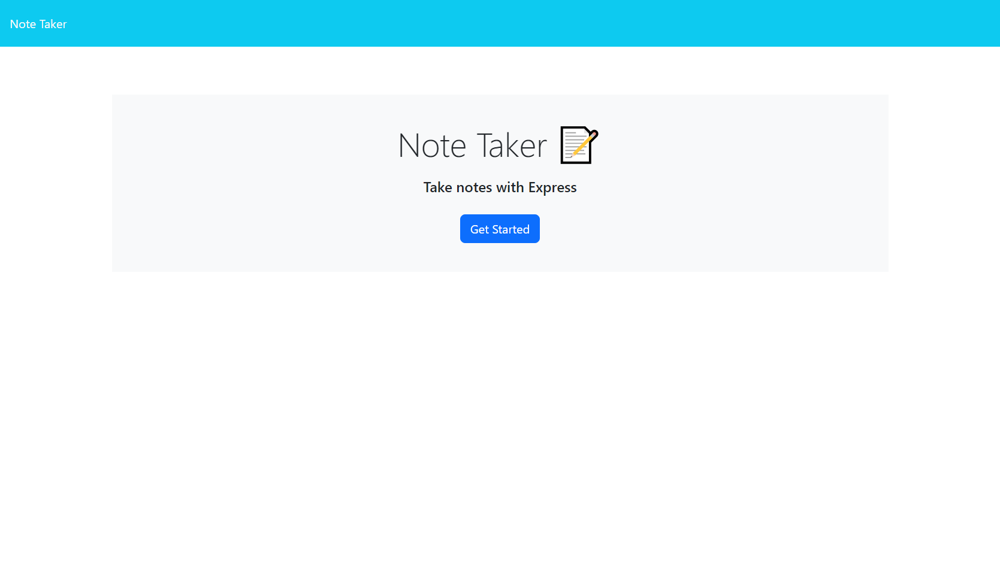
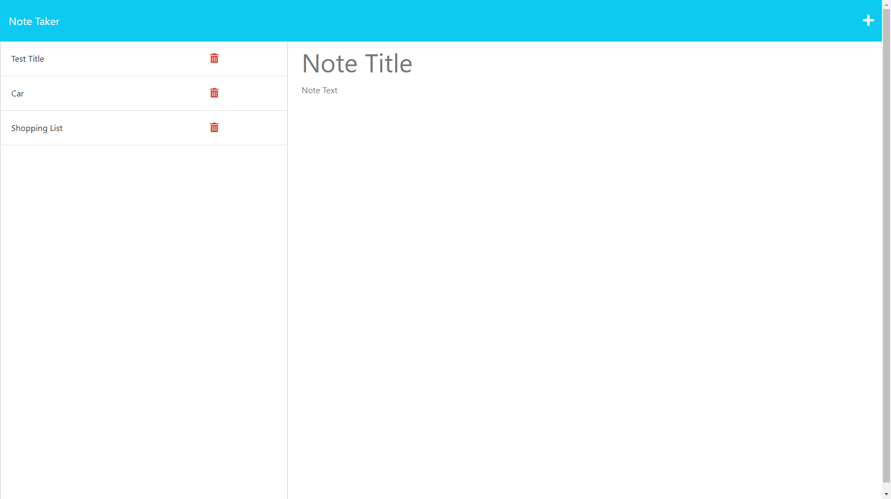
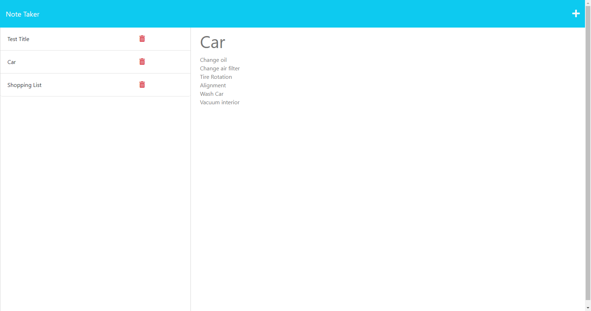

  # Note Taker

  ## Description
This project is designed for users to write and save notes.

  ## Table of Contents
  * [Project Links](#links)
  * [Usage](#usage)
  * [Screenshots](#screenshots)
  * [Credits](#credits)
  * [License](#license)
  * [Contributing](#contributing)
  * [Tests](#tests)
  * [Questions](#questions)

  ## Links
  * [Deployed Application]()
  * [GitHub Repo](https://github.com/jeaustins27/Note-Taker)

  ## Usage
To get started, click the "Get Started" button on the homepage. To write a new note, click the "+" on the upper right hand corner. Enter the title and description of your  note, once you are done click the "save" icon on the upper right hand corner. You will then see your note has been added to left hand column. To access a previously written note, simply click on the title of the note. You can also delete a previously written note by clicking the red garbage  can icon next to the note title.

  ## Screenshots
  
  
  

  ## Credits
  * [W3Schools](https://www.w3schools.com/)
  * [Readme.so](https://readme.so/)
  * [Stack Overflow](https://stackoverflow.com)
  * [Open Weather Map](https://openweathermap.org/forecast5)

  
  ## License
  
  
  This project is licensed under the [MIT](https://choosealicense.com/licenses/mit/) license.

    

  ## Contributing
  You can help with contributing by reaching me via email.

  ## Tests
  There are no tests to be ran.

  ## Questions
  If you have any questions you can reach out via [Email](mailto:JeaustinS27@gmail.com) or you can check out my GitHub profile at here: [GitHub](https://github.com/jeaustins27)
